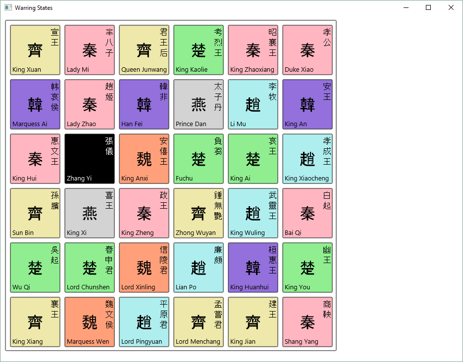
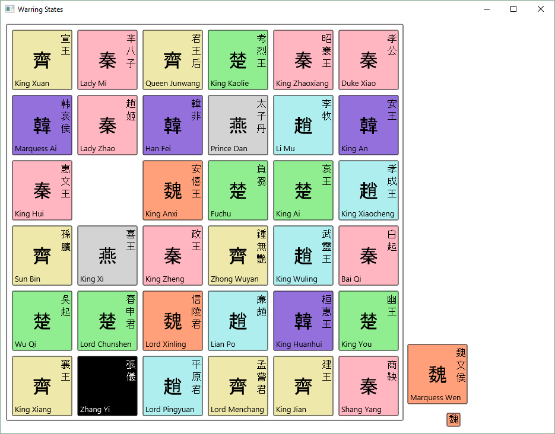
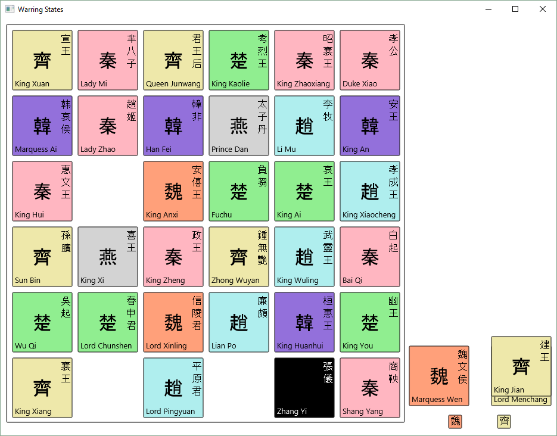
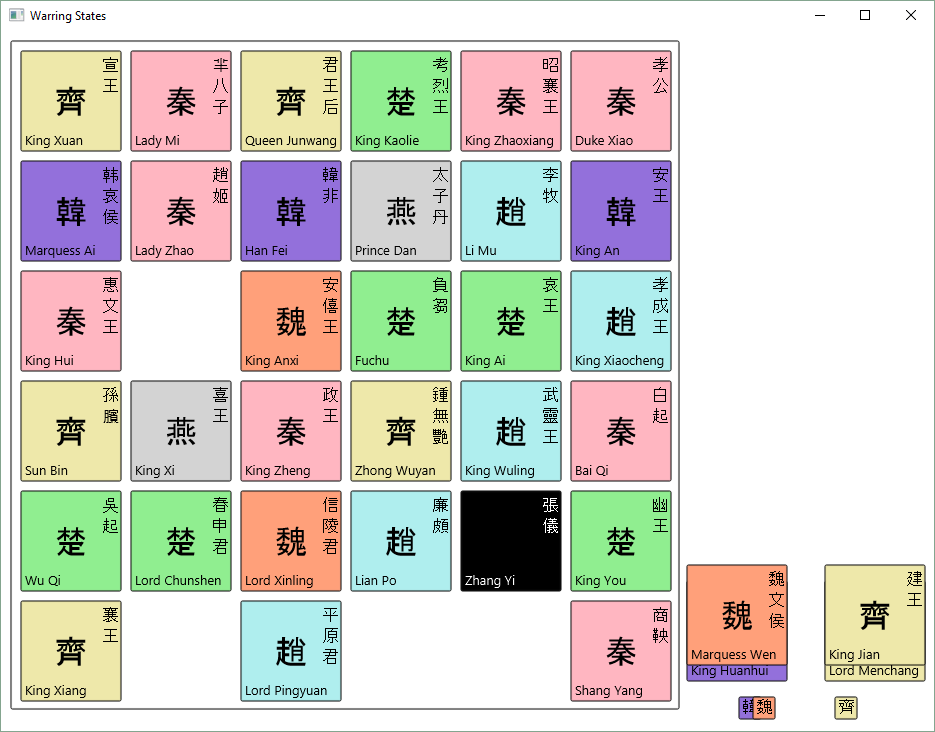
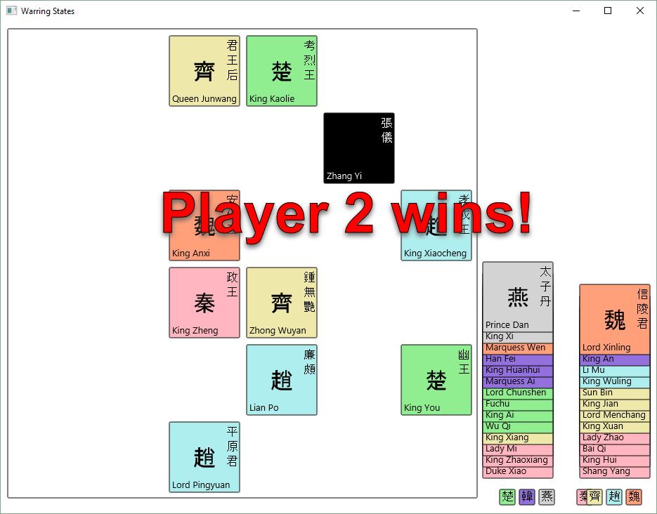
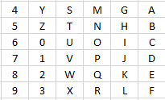

# COMP1110 Assignment 2

## Academic Honesty and Integrity

Honesty and integrity are of utmost importance. These goals are *not* at odds with being resourceful and working collaboratively. You *should* be resourceful, you should collaborate within your team, and you should discuss the assignment and other aspects of the course with others taking the class. However, *you must never misrepresent the work of others as your own*. If you have taken ideas from elsewhere or used code sourced from elsewhere, you must say so with *utmost clarity*. At each stage of the assignment you will be asked to submit a statement of originality, either as a group or as individuals. This statement is the place for you to declare which ideas or code contained in your submission were sourced from elsewhere.

Please read the ANU's [official position](http://academichonesty.anu.edu.au/) on academic honesty. If you have any questions, please ask me.

Carefully review the [statement of originality](originality.md) which you must complete.  Edit that statement and update it as you complete each state of the assignment, ensuring that when you complete each stage, a truthful statement is committed and pushed to your repo.

## Purpose

In this assignment you will exercise a number of major themes of the course, including software design and implemention, using development tools such as Git and IntelliJ, using JavaFX to build a user interface.
As an extension task, you may also explore strategies for writing agents that play games *(there is a special non-assessable lecture in week five that addresses this aspect of the assignment)*.
Above all, this assignment will emphasize group work.

## Assignment Deliverables

The assignment is worth 25% of your total assessment, and it will be marked out of 25. So each mark in the assignment corresponds to a mark in your final assessment for the course. Note that for some stages of the assignment you will get a _group_ mark, and for others you will be _individually_ marked. The mark breakdown and the due dates are described on the [deliverables](https://cs.anu.edu.au/courses/comp1110/assessments/deliverables/) page.

Your work will be marked via your tutor accessing git, so it is essential that you carefully follow instructions for setting up and maintaining your group repository. At each deadline you will be marked according to whatever is committed to your repository at the time of the deadline. You will be assessed on how effectively you use git as a development tool.

## Problem Description

Your task is to implement in Java, using JavaFX, a card game called *Warring States: Joy Begets Sorrow*.
The rules of this game are based on the card game [A Game of Thrones - Hand of the King](https://www.fantasyflightgames.com/en/products/hand-of-the-king/) made by the games developer [Fantasy Flight Games](https://www.fantasyflightgames.com/en/products/hand-of-the-king/).

### Warring States: Joy Begets Sorrow

It is a time of progress and destruction, of triumph and death.
The Seven Kingdoms are at war: Qin, Qi, Chu, Zhao, Han, Wei and Yan.
The cunning Zhang Yi travels from palace to palace, whispering in the ears of the kings, making alliances, and sometimes deceiving.
Who will unite the kingdoms to become Emperor?

#### Rules

The game is played by two to four players, using 36 cards.
There are 35 cards representing characters from the Seven Kingdoms, and one card representing the diplomat Zhang Yi.
Each kingdom has a different number of character cards:

- Qin: eight cards
- Qi: seven cards
- Chu: six cards
- Zhao: five cards
- Han: four cards
- Wei: three cards
- Yan: two cards

The names of the characters for each kingdom are listed in the file [characters.md](src/gui/assets/characters.md).

To start the game, the 36 cards are shuffled and laid out in a 6x6 grid.
The flags of the seven kingdoms are laid next to the grid.
Players take turns to collect characters to their side, by moving Zhang Yi around the grid.
On her turn, a player chooses a direction (North, East, South, or West) and a kingdom (Qin, Qi, Chu, Zhao, Han, Wei, or Yan).
Zhang Yi then moves in the chosen direction to the location of the furthest away character from that kingdom, and collects that character card.
If Zhang Yi passes other characters from the same kingdom while moving, he collects those characters as well.
Each player may move Zhang Yi only once per turn.
At the end of her turn, if the player holds an equal or greater number of characters from a kingdom than any of her opponents, she takes the flag of that kingdom.
(If another player already holds the flag, she takes the flag from that player.)
The game ends when Zhang Yi cannot move, that is, when there are no cards in any direction (North, East, South, or West) from Zhang Yi.
The player who holds the greatest number of flags at the end of the game wins.
If two or more players hold the same number of flags, the player who holds the flag of the kingdom with the greatest number of characters wins.

An example game sequence follows below.
After shuffling the cards, the board setup is as follows:

Player 1 moves Zhang Yi south to take Marquess Wen.
She takes the flag of Wei, as she is the only player who holds characters from Wei.

Then Player 2 moves Zhang Yi east to collect King Jian, also collecting Lord Menchang on the way.
He takes the flag of Qi, as he is the only player who holds characters from Qi.

It is Player 1's turn again. She moves Zhang Yi north to collect King Huanhui, and takes the flag of Han:

Player 2 then moves Zhang Yi west to collect Lord Xinling.
As he now holds an equal number of cards from Wei as Player 1, he takes the flag of Wei from Player 1.

Play continues in this fashion until there is no legal move available.
The flags for each player are counted.
As Player 2 holds four flags and Player 1 only holds three, Player 2 wins the game.

#### Board

The game is played on a board comprised of 36 locations, labelled A-Z and 0-9.
The locations are ordered from north (top) to south (bottom), then east (right) to west (left).

#### Cards

The game comprises 35 character cards, referred to by two character codes:
 - Qin: a0 .. a7
 - Qi: b0 .. b6
 - Chu: c0 .. c5
 - Zhao: d0 .. d4
 - Han: e0 .. e3
 - Wei: f0 .. f2
 - Yan: g0 .. g1

The final card is Zhang Yi, referred to by the two character code 'z9'.

#### Legal Moves

A move is specified by the location char of the destination (A-Z or 0-9).
A move is legal if:
 - there is a card at the chosen location;
 - the location is in the same row or column of the grid as Zhang Yi's current position; and
 - drawing a line from Zhang Yi's current location through the card at the chosen location, there are no other cards along the line from the same kingdom as the chosen card that are further away from Zhang Yi.

#### Encoding Game State

The placement after each move of the game is encoded as a *placement string*,
which is a sequence of one or more *card placement strings*.
Each card placement string consists of exactly three characters:
 - a two-character code representing the card; and
 - a location char representing the current location of the card.

 A placement string consists of 1..36 valid card placement strings, such that no card appears more than once in the placement, and no location contains more than one card.

##### Move Sequence String

A player's move is encoded as a single character representing the destination location for Zhang Yi.
The sequence of moves that led to a particular game state is encoded as a sequence of location characters representing the alternating moves of each player.
All moves in a move sequence must be valid.
The entire history of a game can be reconstructed from a combination of a placement string representing the board setup, and a move sequence representing the player's moves.

## Legal and Ethical Issues

First, as with any work you do, you must abide by the principles of [honesty and integrity](http://academichonesty.anu.edu.au). I expect you to demonstrate honesty and integrity in everything you do.

In addition to those ground rules, you are to follow the rules one would normaly be subject to in a commercial setting. In particular, you may make use of the works of others under two fundamental conditions: a) your use of their work must be clearly acknowledged, and b) your use of their work must be legal (for example, consistent with any copyright and licensing that applies to the given material). *Please understand that violation of these rules is a very serious offence.*  However, as long as you abide by these rules, you are explicitly invited to conduct research and make use of a variety of sources. You are also given an explicit means with which to declare your use of other sources (via originality statements you must complete). It is important to realize that you will be assessed on the basis of your original contributions to the project. While you won't be penalized for correctly attributed use of others' ideas, the work of others will not be considered as part of your contribution. Therefore, these rules allow you to copy another student's work entirely if: a) they gave you permission to do so, and b) you acknowledged that you had done so. Notice, however, that if you were to do this you would have no original contribution and so would recieve no marks for the assigment (but you would not have broken any rules either).

## Evaluation Criteria

It is essential that you refer to the [deliverables page](https://cs.anu.edu.au/courses/comp1110/assessments/deliverables/) to check that you understand each of the deadlines and what is required.   Your assignment will be marked via git, so all submittable materials will need to be in git and in the *correct* locations, as prescribed by the [deliverables page](https://cs.anu.edu.au/courses/comp1110/assessments/deliverables/).

**The mark breakdown is described on the
[deliverables](https://cs.anu.edu.au/courses/comp1110/assessments/deliverables/) page.**

### Part One

In the first part of the assignment you will:
* Implement parts of the text interface to the game (Tasks #2, and #3).
* Implement a simple viewer that allows you to visualise game states (Task #4).

The criteria for the [completion of part one](https://cs.anu.edu.au/courses/comp1110/assessments/deliverables/#D2C) is as follows:

**Pass**
* Tasks #2 and #3

**Credit**
* Task #4 *(in addition to all tasks required for Pass)*

**Distinction**
* Task #5 and #6 *(in addition to all tasks required for Credit)*

### Part Two

Create a fully working game, using JavaFX to implement a playable
graphical version of the game in a 933x700 window.

Notice that aside from the window size, the details of exactly how the
game looks etc, are **intentionally** left up to you.  The diagrams
above are for illustration purposes only, although you are welcome to
use all of the resources provided in this repo, including the bitmap
images for each of the eight shapes.

The only **firm** requirements are that:

* you use Java and JavaFX,
* the game respects the specification of the game given here,
* the game be easy to play,
* it runs in a 933x700 window, and
* that it is executable on a standard lab machine from a jar file called `game.jar`,

Your game must successfully run from `game.jar` from within another user's (i.e.
your tutor's) account on a standard lab machine (in other words, your game must
not depend on features not self-contained within that jar file and the Java 8 
runtime).

**Pass**
* Correctly implements all of the <b>Part One</b> criteria.
* Appropriate use of git (as demonstrated by the history of your repo).
* Completion of Tasks #7 and #8
* Executable on a standard lab computer from a runnable jar file, game.jar, which resides in the root level of your group repo.

**Credit**
* _All of the Pass-level criteria, plus the following..._
* Task #9

**Distinction**
* _All of the Credit-level criteria, plus the following..._
* Tasks #10 and #11

**High Distinction**
* _All of the Distinction-level criteria, plus the following..._
* Tasks #12
